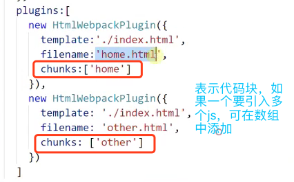

1、webpack？

模块打包机


2、学习的内容


代码转换---loader(文件预处理：将不同的语言转为js)

3、下载安装

既可以安装本地的webpack，也可以安装全局的webpack，安装全局的webpack可能会导致版本的不一致，

通常我们会将 Webpack 安装到项目的依赖中，这样就可以使用项目本地版本的 Webpack。但是这样就不能在命令行中直接使用webpack命令了，只能使用npm run 中的本地webpack

注意：必须先创建package.json

    # 进入项目目录
    # 确定已经有 package.json，没有就通过 npm init 创建
    # 安装 webpack 依赖
    $ npm install webpack --save-dev(webpack3.0)

    # 进入项目目录
    # 确定已经有 package.json，没有就通过 npm init 创建
    # 安装 webpack 依赖；安装webpack-cli是为了执行webpack的打包工作
    npm install webpack webpack-cli -D(webpack4.0)

-D：development，只在开发环境依赖，线上不用

安装完成之后


package.json ———— npm init

    {
      "name": "webpack-learn",
      "version": "1.0.0",
      "description": "",
      "main": "index.js",
      "scripts": {
        "test": "echo \"Error: no test specified\" && exit 1"
      },
      "author": "",
      "license": "ISC"
    }

npm init：初始化配置文件

npm install：安装依赖

在安装本地包时会根据package-lock.json向package.json中写入依赖项

package.json

    用于存放模块的名称、版本、作者、机构、模块入口、依赖等信息。
    例子：新建一个目录gulp_demo,在这个目录下通过命令：npm init 。会新建一个全新的package.json文件。


配置项介绍：
必选项

- name 模块的名称，命名时不能转义字符，不能以.和_开头。
- version 模块的版本号 其格式：主版本号.福版本号.补丁版本号
      在 dependencies devDependencies 等配置项中可使用语义化版本语法。
- main : 模块入口文件(包的里面的文件)，包的index.js中的name属性就是要安装的包的包名
 
  

可选项

- keywords ：关键字，数组类型
  - author ： 发起者信息
- engines ： node 版本
- repository ： 源码托管地址
- scripts ：在命令行中 输入 npm script 时实际执行的程序
  
  > 注意：npm run 走的是开发环境的依赖

- dependencies和devDependencies ： 用于配置生产环境和开发环境依赖包

webpack打包项目

①创建webpack.config.js，创建src/main.js

    var path = require('path');
    var webpack = require('webpack');
    
    module.exports = {
        // 设置基础路径
        context: path.resolve(__dirname,'./src'),
        entry: {
            // 以context为基础的相对路径，./是为了表示这是个相对路径
            app: './main.js'
        },
        output: {
            path: path.resolve(__dirname,'./dist'),
            filename: "bundle.js"
        }
    }

②在package.json文件的scripts中加

    "start": "webpack"
    # webpack 是 --config webpack.config.js的缩写，就是根据webpack的配置进行文件打包

注意：npm run start虽然等价于webpack命令

在项目开始时，安装的webpack 和webpack-cli都是安装在开发环境的，npm run start 执行的 webpack 走的是项目的开始依赖(npx webpack同理)，但想直接使用webpack命令的话必须在全局先安装webpack-cli工具

③运行

    npm run start(开发依赖) 或 npx(开发依赖) webpack 或webpack(必须全局安装webpack-cli)

打包后的结果：在根路径下生成一个dist/bundle.js

4、webpack基础配置-生成一个dist+dist/main.js

(1)0配置

在webpack.config.js中进行配置入口文件

打包的入口文件：

    src/index.js

打包命令：执行这句命令

    npx webpack 或 webpack(如果全局安装了)

打包结果：

在根目录下生成一个dist(默认名称)文件夹，文件夹中有一个main.js(默认名称)

在实际中，main.js常被命名为bundle.js

vscode插件coderender：帮助执行node代码

(2)手动配置webpack

webpack 是node写出来的，用node的写法来写

默认配置文件的名称是webpack.config.js或webpackfile.js

path.resolve()：将一个相对路径解析成绝对路径（将其中的参数给合成一个路径）


开发环境下不压缩文件，生产环境下压缩文件，默认生产环境

(3)修改默认的配置文件名

①先创建一个webpack.config.my.js

②配置文件

③执行命令：

```$xslt
npx webpack --config webpack.config.my.js
```

这样就会执行webpack.config.my.js这个配置文件

但是这样太长了，比较麻烦，需要进行优化

解决：在package.json中配置脚本

```$xslt
"scripts": {
    "build": "webpack --config webpack.config.my.js",
 },
```
这样只需要执行npm run build即可完成打包

如果想在执行命令行打包时再传参，如下：

package.json

"scripts": {
    "build": "webpack",
    "dev": "webpack-dev-server"
},

npm run build :打包

npm run dev: 启动静态服务器

命令行

```$xslt
npm run build --  --config webpack.config.my.js
```

注意：build后的 — 不能省，不加build后面的两个 - -，不会把后面的识别为参数

5、配置开发服务器-生成一个dist/index.html

在本地，通常情况是通过单击html来访问一个file路径下的文件，如果希望以localhost或ip的方式来访问，需要启动一个本地的服务器

实现方法：

①启一个本地服务器

②以当前dist目录为静态目录的起点(默认以根目录作为静态目录的起点，所以需要手动配置devServer，使其以dist目录为静态目录的起点)

③将打包后的结果放到默认的index.html中,并且将最后的结果放到dist目录下(会在该目录下生成一个新的html文件,默认的html文件又称为模板文件)

第一步：

    npm install webpack-dev-server -D

在package.json 中配置脚本

    "dev": "webpack-dev-server"

    npx webpack-dev-server -D 或 npm run dev

它会生成一个默认的访问地址：localhost:8080，并且以当前根目录作为静态目录


第二步：期望是以build目录作为静态服务起点，不是根目录，需要设置开发服务器


contentBase:以指定的目录作为静态服务的起点

open: true, 启动服务后，自动打开浏览器

第三步：引入插件htmlWebpackPlugin，作用：一般index.html在根目录下，该插件可以将打包后的结果放到index.html中，并将结果放到dist目录下

结果：在dist目录下，生成一个index.html文件，并且自动引入了dist下的资源

①安装

    npm install html-webpack-plugin -D

②引入

```$xslt
let htmlWebpackPlugin = require('html-webpack-plugin')
```
③配置


template: 模版文件的路径

6、样式处理loader 

- style-loader：将将模块的导出作为样式添加到 DOM 中(将css插入到dom中)
- css-loader：解析css中通过import引入的css，并将多个css文件进行合并
- postcss-loader：加载和转译css，使用autoprefix包时需要用这个包
- Less-loader：解析并转译less (less→css)
- sass-loader：解析并转译sass
- stylus-loader：解析并转译stylus

loader的作用：webpack 可以使用 loader 来预处理文件。这允许你打包除 JavaScript 之外的任何静态资源。

基础配置

(1)处理css

    npm install style-loader css-loader -D


css-loader:解析@import语法,将多个css进行合并

style-loader:将css文件插入到header标签中

 注意:loader的顺序默认是从右向左执行，应该先合并后插入

还可以通过options属性中的insertAt设置插入位置，越靠上层级越高


(2)处理less

    npm install less less-loader css-loader -D


其他的同理

抽离css样式-插件mini-css-extract-plugin，会在dist目录下生成一个main.css

style-loader默认将css以<style></style>的方式插入到了head中，现在将css抽离出来，以link的方式引入

①安装

    npm install mini-css-extract-plugin -D

②引入

```$xslt
let MiniCssExtractPlugin = require('mini-css-extract-plugin')
```
③在plugins中生成插件实例


④在moudle下的css配置项中用实例替代style-loader


自动添加前缀-包autoprefixer

使用这个包前需要用loader预处理，这里使用postcss-loader

①安装

    npm install postcss-loader autoprefixer -D

②在webpack.config.js中配置postcss-loader


③创建一个postcss.config.js文件
```$xslt
module.exports = {
	plugins: [require('autoprefixer')]
}
```
优化css资源(压缩)------mini-css-extract-plugin

优化js资源(压缩)------uglifyjs-webpack-plugin

使用mini-css-extract-plugin插件，只是将css抽离出来，并不会去压缩css代码，需要手动压缩代码，见mini-css-extract-plugin包的官网

①安装插件

    npm install optimize-css-assets-webpack-plugin -D

    npm i uglifyjs-webpack-plugin -D 

②配置webpack.config.js

    const UglifyJsPlugin = require('uglifyjs-webpack-plugin')
    const MiniCssExtractPlugin = require('mini-css-extract-plugin');
    const OptimizeCSSAssetsPlugin = require('optimize-css-assets-webpack-plugin');
    module.exports = {
      // webpack4:优化
      optimization: {
        // 压缩
        minimizer: [
          // 压缩js
          new UglifyJsPlugin({
            // 是否缓存
            cache: true，
            // 是否并发打包
            parallel: true，
            // 源码映射，将es6解析为es5后，需要源码映射来进行调试
            sourceMap: true
          }), 
          // 压缩css
          new OptimizeCSSAssetsPlugin({})
        ],
      },
      plugins: [
        new HtmlWebpackPlugin({
          filename: 'index.html',
          template: 'dist/index.html
        })
        new MiniCssExtractPlugin({
          filename: 'main.css',
        }),
      ],
      module: {
        rules: [
          {
            test: /\.css$/,
            use: [MiniCssExtractPlugin.loader, 'css-loader'],
          },
        ],
      },
    };

7、JS模块处理(ES6→ES5)

babel：转化js

将高级语法转为低级

①安装

babel-loader：对es6代码进行预处理

babel-core：转es6代码

babel-/preset-env：要把es6的代码转为哪个版本的

    npm install babel-loader @babel/core @babel/preset-env

②配置loader项

presets：预设，这是一个大插件的集合，还需要一些小的插件

plugins：小插件

    npm install @babel/plugin-proposal-class-properties -D
    npm install @babel/plugin-proposal-decorators -D

- @babel/plugin-proposal-class-properties：提案中的类的属性插件，解决es的版本问题(es7+)
- @babel/plugin-proposal-decorators：装饰器插件


8、js语法和校验

9、全部变量引入

10、图片处理

创建图片的三种方式：


对于第一、第二种方法，使用图片打包----file-loader

> file-loader：默认会在内部生成一张图片放到build目录下，同时把生成图片的名字返回来

第一种，image的属性直接给一个字符串并不能生效，必须通过import引入png文件

第二种，将css引入到index.js中

file-load：默认会在内部生成一张图片，同时将图片放到build目录下，并把生成图片的名字返回来

①安装

    npm install file-loader -D

②配置


当网站上有很多小图时，并不希望发出http请求，可以将它们变成base64

一般，对图片不会直接去用file-loader，而是使用url-loader

    npm install url-loader -D


第三种，使用html-withimg-loader

①安装

    npm install html-withimg-loader -D

②配置


11、dist下打包文件分类

图片分类


css分类


给所有资源加上域名


只给图片加域名


12.打包多页应用(多个入口文件)

打包js


打包html

上面有两个入口和两个出口，就需要两个html，所以需要两个实例


默认的会将引用的资源都插入到第一个实例中去，所以此时在home.index中引入了两个js文件，为了让home.index中只引入home.js，other.html中只引入了other.js，需要加一个chunks（代码块）的属性



13.sourse-map资源映射

在解析js的过程中，可能会把高级语法解析为低级语法，这样就需要一个从源码到打包文件的一一对应的映射关系，这样在error的时候可进行调试

    npm install babel-loader @babel/core @babel/preset-env webpack-dev-server -D


14.实时自动打包watch


15.webpack小插件应用

- cleanWebpackPlugin  清除
- copyWebpackPlugin  复制
- bannerPlugin--------- webpack内置插件-版权声明插件

cleanWebpackPlugin  清除

在打包时，如果输出的目录名称不一样(比如：加了hash)，每次打包都会生成一个新的输出文件，这样，就会在dist目录生成好多文件，如果希望每次打包时都将之前打包的文件清除掉，只保留当前打包的文件

    npm install clean-webpack-plugin -D

```javascript
let cleanWebpackPlugin = require('clean-webpack-plugin')

new cleanWebackPlugin('./dist')
```

该插件会将dist都删除

copyWebpackPlugin  复制

该插件可以将其他文件夹中的文件复制到dist目录下

    npm install copy-webpack-plugin -D

```javascript
let copyWebpackPlugin = require('copy-webpack-plugin')
```

    plugins: [
        new copyWebpackPlugin([
            {
                from: './copy.txt',
                to: '../dist'
            }
        ])
    ]

注意：to属性也可不写，默认就会拷贝到dist目录下

bannerPlugin--------- webpack内置插件-版权声明插件

webpack内置插件需要引入webpack模块，不需要安装

该插件会将版权声明以注释的形式插到每个打包文件的头部

```javascript
let webpack = require('webpack')

plugins: [
    new webpack.BannerPlugin('make 2019 by xxx')
]
```
16.webpack跨域问题

第一种：代理proxy，有服务端

①写一个服务端文件server.js

express 默认会启动一个webpack-dev-server，node中内置了express模块，可以用来帮助我们完成一个服务端的任务

设置代理的前提条件： 
1、需要使用本地开发插件：webpack-dev-server。 
2、webpack-dev-server使用的是http-proxy-middleware来实现跨域代理的。


服务器文件写好后，可在localhost:3000test一下

②写ajax请求


此时，服务器的端口是3000，本地的端口是8080，存在跨域问题

③在webpack.config.js 的DevServer中配置proxy

8080端口是webpack-dev-server本地服务器启动的，可通过proxy将请求转发给服务器端


访问以api开头的都去3000端口找

后端一般不会加api

解决：请求的时候还是以api开头， 转发的时候去掉api，用pathRewrite属性，重写为空

    module.exports = {
      //...
      devServer: {
        proxy: {
          '/api': {
            target: 'http://www.baidu.com/',
            pathRewrite: {'^/api' : ''},
            changeOrigin: true,     // target是域名的话，需要这个参数，
            secure: false,          // 设置支持https协议的代理
          },
          '/api2': {
              .....
          }
        }
      }
    };

第二种：无服务端

如果只想mock数据，这时不存在跨域

devServer内部就是一个express，可以直接将服务器的代码写在里面


第三种：在服务端启动webpack，有服务端

webpack启动在服务端，用了服务器的端口，不存在跨域


webpack-dev-middleware：webpack开发服务的中间件，可以在服务端启动webpack

17.resolve属性的配置
